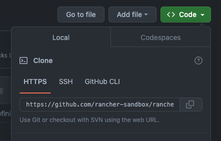

# Create & import your first cluster using Fleet

This section will guide you through creating your first cluster and importing it into Rancher Manager using a GitOps workflow with Fleet.

## Prerequisites

- Rancher Manager cluster with Rancher Turtles installed
- Cluster API providers installed for your scenario - we'll be using the Docker infrastructure and Kubeadm bootstrap/controlplane providers in these instructions
- **clusterctl** CLI - see the [releases](https://github.com/kubernetes-sigs/cluster-api/releases)

## Create your cluster definition

The **clusterctl** CLI can be used to generate the YAML for a cluster. When you run `clusterctl generate cluster` command is run, it will connect to the management cluster to see what infrastructure providers have been installed. Also, it will take care of replacing any tokens in the chosen template (a.k.a flavour) with values from environment variables.

Alternatively, you can craft the YAML for your cluster manually. If you decide to do this then you can use the **templates** that infrastructure providers publish as part of their releases. For example, the AWS provider [publishes files](https://github.com/kubernetes-sigs/cluster-api-provider-aws/releases/tag/v2.2.1) prefixed with **cluster-template** that can be used as a base. You will need to replace any tokens yourself or by using clusterctl (e.g. `clusterctl generate cluster test1 --from https://github.com/kubernetes-sigs/cluster-api-provider-aws/releases/download/v2.2.1/cluster-template-eks.yaml > cluster.yaml`).

> This guide does not use ClusterClass. Templates that use ClusterClass will require that the experimental feature be enabled.

To generate the YAML for the cluster do the following (assuming the Docker infrastructure provider is being used):

1. Open a terminal and run the following:

```bash
export CONTROL_PLANE_MACHINE_COUNT=1
export WORKER_MACHINE_COUNT=1
export KUBERNETES_VERSION=v1.26.4

clusterctl generate cluster cluster1 \
--from https://raw.githubusercontent.com/rancher-sandbox/rancher-turtles-fleet-example/templates/docker-kubeadm.yaml \
> cluster1.yaml
```

2. View **cluster1.yaml** to ensure there are no tokens. You can make any changes you want as well.

> The Cluster API quickstart guide contains more detail. Read the steps related to this section [here](https://cluster-api.sigs.k8s.io/user/quick-start.html#required-configuration-for-common-providers).

## Create your repo for Fleet

1. Create a new git repository (this guide uses GitHub)
2. Create a new folder called **clusters**
3. Move the **cluster1.yaml** file you generated in the last section to the **clusters** folder.
4. Create a file called **fleet.yaml** in the root and add the following contents

```yaml
namespace: default
```

5. Commit the changes

> The **fleet.yaml** is used to specify configuration options for fleet (see [docs](https://fleet.rancher.io/ref-fleet-yaml) for further details). In this instance its declaring that the cluster definitions should be added to the **default** namespace

After the described steps there will be a repository created structure similar to the example: <https://github.com/rancher-sandbox/rancher-turtles-fleet-example>

## Mark Namespace for auto-import

To automatically import a CAPI cluster into Rancher Manager there are 2 options:

1. label a namespace so all clusters contained in it are imported.
1. label an individual cluster definition so that it's imported.

In both cases the label is `cluster-api.cattle.io/rancher-auto-import`.

This walkthrough will use the first option of importing all clusters in a namespace.

1. Open a terminal
2. Label the default namespace in your Rancher Manager cluster:

```bash
kubectl label namespace default cluster-api.cattle.io/rancher-auto-import=true
```

## Configure Rancher Manager

Now the cluster definitions are committed to a git repository they can be used to provision the clusters. To do this they will need to be imported into the Rancher Manager cluster (which is also acting as a Cluster API management cluster) using the **Continuous Delivery** feature (which uses Fleet).

There are 2 options to provide the configuration. The first is using the Rancher Manager UI and the second is by applying some YAML to your cluster. Both are covered below.

### Using the Rancher Manager UI

1. Go to Rancher Manager
2. Select **Continuos Delivery** from the menu:

3. Select **fleet-local** as the namespace from the top right

4. Select **Git Repos** from the sidebar
5. Click **Add Repository**
6. Enter **clusters** as the name
7. Get the **HTTPS** clone URL from your git repo

8. Add the URL into the **Repository URL** field
9. Change the branch name to **main**
10. Click **Next**
11. Click **Create**
12. Click on the **clusters** name
13. Watch the resources become ready
14. Select **Cluster Management** from the menu
15. Check your cluster has been imported

### Using kubectl

1. Get the **HTTPS** clone URL from your git repo
2. Create a new file called **repo.yaml**
3. Add the following contents to the new file:

```yaml
apiVersion: fleet.cattle.io/v1alpha1
kind: GitRepo
metadata:
  name: clusters
  namespace: fleet-local
spec:
  branch: main
  repo: <https://github.com/rancher-sandbox/rancher-turtles-fleet-example.git>
  targets: []
```

4. Apply the file to the Rancher Manager cluster using **kubectl**:

```bash
kubectl apply -f repo.yaml
```

5. Go to Rancher Manager
6. Select **Continuos Delivery** from the side bar
7. Select **fleet-local** as the namespace from the top right
8. Select **Git Repos** from the sidebar
9. Click on the **clusters** name
10. Watch the resources become ready
11. Select **Cluster Management** from the menu
12. Check your cluster has been imported
